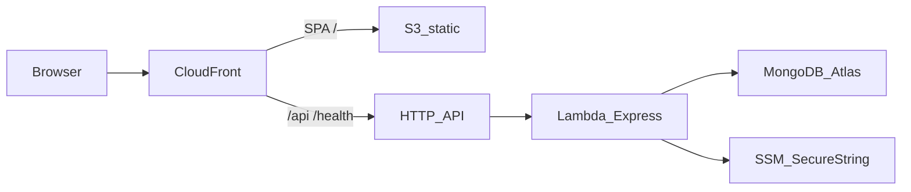

# Pintravel AWS 배포 실습 — 완료 보고서

작성일: 2026-09-25  
리전: `ap-northeast-2` (서울)  
스택: `pintravel-prod`  
사이트: `https://dm0kbipnsg1gx.cloudfront.net`

이 문서는 최초 배포 계획(서버리스 1차)부터 실제 구축·장애 대응·기능 검증까지의 기록이다. 재현 명령은 [deploy-aws.md](./deploy-aws.md)를 따른다.

---

## 1. 계획 목적

캡스톤 앱(Vite SPA + Express + MongoDB)을 **상시 EC2가 아닌** 저비용 서버리스로 올리고, 포트폴리오에 IaC·시크릿 분리·동일 출처 HTTPS를 남기는 것이 목표였다.

| 계획 | 선택 |
|------|------|
| 컴퓨팅 | API Gateway HTTP API + Lambda (Express를 `serverless-http`로 래핑) |
| 프론트 | S3 + CloudFront (SPA, `/api`·`/health`는 API로 프록시) |
| DB | MongoDB Atlas M0 (DocumentDB/RDS 없음) |
| 시크릿 | SSM Parameter Store SecureString |
| IaC | AWS SAM (`infra/aws/template.yaml`) |
| 실시간 협업 (Socket.IO, UC7) | **1차 제외** (Lambda·인메모리 세션과 맞지 않음) |

성공 기준(계획): CloudFront HTTPS로 랜딩·로그인·지도 REST, `/health`가 Lambda를 탐, 저장소에 시크릿 없음, 소켓은 범위 밖임을 명시.

---

## 2. 최종 아키텍처



- 브라우저는 로컬 Vite 프록시와 같이 `fetch('/api/...')` 상대 경로를 쓴다.
- CloudFront Function이 `/login` 등 확장자 없는 SPA 경로를 `index.html`로 바꾼다. `/api`, `/health`는 그대로 API로 간다.
- Lambda 타임아웃 29초, 메모리 512MB, `nodejs20.x` arm64.

로컬 엔트리는 [`apps/api/src/index.js`](../apps/api/src/index.js)(HTTP + Socket.IO), 배포 엔트리는 [`apps/api/src/lambda.js`](../apps/api/src/lambda.js)(REST만).

---

## 3. 저장소에 넣은 산출물

| 경로 | 역할 |
|------|------|
| [`apps/api/src/app.js`](../apps/api/src/app.js) | Express 앱 팩토리 (`listen`과 분리) |
| [`apps/api/src/lambda.js`](../apps/api/src/lambda.js) | Lambda 핸들러, Mongo 재사용 |
| [`apps/api/src/config/loadSsm.js`](../apps/api/src/config/loadSsm.js) | `/pintravel/prod/*` → `process.env` |
| [`infra/aws/template.yaml`](../infra/aws/template.yaml) | SAM: Lambda, HTTP API, S3, CloudFront, OAC |
| [`infra/aws/samconfig.toml`](../infra/aws/samconfig.toml) | `pintravel-prod`, 서울 |
| [`infra/aws/github-oidc.yaml`](../infra/aws/github-oidc.yaml) | GitHub Actions OIDC 역할 (선택) |
| [`.github/workflows/deploy-aws.yml`](../.github/workflows/deploy-aws.yml) | `sam deploy` + S3 sync + 무효화 |
| [`docs/deploy-aws.md`](./deploy-aws.md) | 운영·재현 가이드 |
| [`docs/aws-deploy-report.md`](./aws-deploy-report.md) | 이 완료 보고서 |
| [루트 README.md](../README.md) | 로컬 실행·라우트·배포 진입점 |

---

## 4. 실제 수행 순서

### 4.1 계정 가드레일

- 루트가 아닌 IAM 사용자(`TEST_PINVEL`)에 `AdministratorAccess`.
- 콘솔 리전 서울. 월별 비용 예산(예: 5 USD).
- 해당 사용자 액세스 키로 `aws configure` (`ap-northeast-2`, `json`). AWS CLI가 묻는 AI MCP 연동은 배포에 불필요하여 거부.

### 4.2 PC 도구

- Node는 기존 설치분 사용.
- `winget`으로 AWS CLI, SAM CLI, GnuWin32 Make. Make는 설치 후 PATH에 `C:\Program Files (x86)\GnuWin32\bin` 추가가 필요했다.

### 4.3 MongoDB Atlas

- 로컬 `127.0.0.1`과 Atlas는 별개 DB. 프로젝트에 클러스터가 없어 M0(`ClusterPinTravel` / `Cluster0`)를 신규 생성.
- Database User(앱용 계정)와 Network Access `0.0.0.0/0` (Lambda IP 비고정).
- 연결 문자열은 `mongodb+srv://...` (브라우저의 `cloud.mongodb.com` HTML URL이 아님).
- Atlas **Project Identity** 화면은 이메일 로그인 사용자이고, DB 비밀번호는 **Database Users**에서만 다룬다.

### 4.4 SSM

접두사 `/pintravel/prod`. Lambda는 `.env`를 읽지 않는다.

필수: `MONGODB_URI`, `JWT_SECRET`.  
일정·지도 서버 호출: `NCP_APIGW_API_KEY_ID`, `NCP_APIGW_API_KEY`.  
선택: `GEMINI_API_KEY`.  
프론트 빌드에는 지도 **Key ID만** `VITE_*`로 넣고 Client Secret은 넣지 않음.

### 4.5 인프라·웹

```text
cd infra/aws
sam build
sam deploy
```

이후 `npm run build -w web` → S3 sync → CloudFront invalidation. 정적 사이트는 이 시점에 열리지만, API는 Atlas·SSM이 맞아야 `/health`가 산다.

### 4.6 데이터 이전

빈 Atlas로는 지도 핀·축제가 없다. 로컬 `pintravel`을 dump한 뒤 restore.

- dump URI는 **로컬** `.env`의 인증 포함 주소 (인증 없으면 `listCollections Unauthorized`).
- restore URI는 **Atlas** `mongodb+srv://`.
- 디렉터리 dump는 도구가 `.bson`을 skip하는 경우가 있어 **`--archive`로 dump/restore**가 성공했다 (약 15,668 문서).

---

## 5. 발생한 문제와 해결

| 증상 | 원인 | 대응 |
|------|------|------|
| `make` 없음 | GnuWin32는 설치됐으나 PATH 미등록 | 사용자 PATH에 `GnuWin32\bin` 추가 후 터미널 재시작 |
| Atlas에 로컬 컬렉션이 없음 | 클라우드 클러스터가 원래 없음 | M0 생성 후 dump/restore 또는 sync 스크립트 |
| mongorestore `bad auth` | DB 사용자 비밀번호 불일치 (사이트 로그인 비번과 혼동 가능) | Database Users 비밀번호로 URI 구성. 유출 시 즉시 교체 |
| restore `don't know what to do with file/subdirectory` | URI의 `/pintravel`이 `--db`로 해석되거나 dump 레이아웃과 불일치 | 부모 폴더·`--archive` 사용, URI에서 DB path를 빼거나 archive 사용 |
| 사이트는 뜨고 핀 없음 + API 500 | 빈 화면이 아니라 **서버 기동 실패** | CloudWatch: `MongoServerError: bad auth` |
| `/health`가 `{"message":"Internal Server Error"}` | Express health가 아니라 API Gateway가 Lambda 예외를 감쌈 | SSM `MONGODB_URI`를 restore에 성공한 값으로 갱신 후 Lambda 구성 변경으로 콜드 스타트 |

핵심: PC에서 restore가 되는 URI와 Lambda가 SSM에서 읽는 URI가 **같아야** 한다. 비밀번호를 바꾼 뒤 SSM만 옛값이면 `/health`부터 전부 500이다. SSM 갱신 후에는 Lambda가 워 메모리의 옛 env를 쓸 수 있어 `update-function-configuration`으로 한 번 재시작했다.

함수 이름 예: `pintravel-prod-ApiFunction-IR0xGxvHzHW2`.

---

## 6. 검증 결과 (완료)

계획 성공 기준 및 추가 기능 확인 (CloudFront URL, 2026-09-25).

| 항목 | 결과 |
|------|------|
| HTTPS CloudFront 접속 | 통과 |
| `GET /health` → `{ ok: true, service: "pintravel-api" }` | 통과 (SSM URI 수정 후) |
| 회원가입 / 로그인 | 통과 |
| 마이페이지 | 통과 |
| 축제·지도 핀 (REST, Atlas `festivals` / `busan_places`) | 통과 |
| 일정 생성 (NCP·관련 API) | 통과 |
| 시크릿 Git 미포함 (`.env` gitignore, SSM) | 준수 |
| Socket.IO 실시간 협업 | **의도적 미배포** (로컬만) |

---

## 7. 명시적 범위 밖

- UC7 실시간 협업: 클라우드 1차에 없음. 필요 시 App Runner/Lightsail 등 상시 프로세스 분리.
- 커스텀 도메인·ACM: 하지 않음. `*.cloudfront.net`으로 충분.
- GitHub Actions OIDC 자동 배포: 템플릿·워크플로는 저장소에 있음. 이번 완료는 수동 `sam deploy` + S3 sync 기준.
- 계정 프리 티어 만료: 이 스택은 사용량 과금. 예산 알림으로 감시.

---

## 8. 이후 운영 짧은 메모

- 프론트만 고치면: `npm run build -w web` → S3 sync → CloudFront `/*` 무효화.
- API만 고치면: `infra/aws`에서 `sam build` / `sam deploy`.
- Atlas 비밀번호를 바꾸면 **반드시** SSM `MONGODB_URI`를 같이 바꾸고 Lambda를 재시작한다.
- 로그: CloudWatch `/aws/lambda/pintravel-prod-ApiFunction-*`.
- 과금: Billing → Cost Explorer에서 CloudFront·Lambda 확인.

---

## 9. 결론

계획한 서버리스 1차 경로(S3 + CloudFront + HTTP API + Lambda + Atlas + SSM)를 서울 리전에 올렸고, 빈 DB·dump 형식·Lambda Mongo 인증 불일치를 해결한 뒤 **회원가입부터 일정 생성까지 REST 기능을 CloudFront에서 확인**했다. 실시간 소켓은 계획대로 1차 범위에 넣지 않았다.
