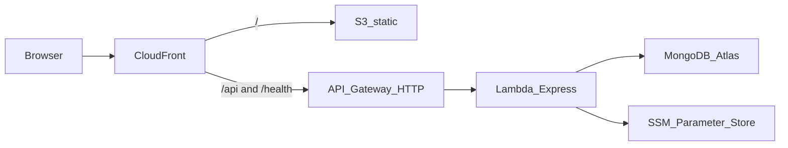

# AWS 배포 (Pintravel)

실습 완료 기록(계획 대비 검증·이슈): [aws-deploy-report.md](./aws-deploy-report.md).  
현재 배포: `https://dm0kbipnsg1gx.cloudfront.net` · 스택 `pintravel-prod` · 리전 `ap-northeast-2`.

1차 목표는 **저비용 서버리스 + 문서화**입니다.

실시간 협업(Socket.IO, UC7)은 Lambda/HTTP API와 맞지 않아 **이 스택에 포함하지 않습니다.** 로컬 `npm run dev:api`에서는 기존처럼 동작합니다.



## 계정 가드레일

루트 계정 액세스 키로 배포하지 않습니다.

1. IAM 관리자(또는 충분한 권한) 사용자/역할만 콘솔·CLI에 사용합니다.
2. **Billing → Budgets / CloudWatch 결제 알림**을 켭니다 (예: $5, $20).
3. 콘솔 기본 리전을 `ap-northeast-2`로 맞춥니다.
4. GitHub 배포는 장기 키 대신 **OIDC 역할**을 씁니다. 스택: [infra/aws/github-oidc.yaml](../infra/aws/github-oidc.yaml).

```bash
aws cloudformation deploy \
  --region ap-northeast-2 \
  --stack-name pintravel-github-oidc \
  --template-file infra/aws/github-oidc.yaml \
  --capabilities CAPABILITY_NAMED_IAM \
  --parameter-overrides GitHubOrg=YOUR_ORG GitHubRepo=pintravel
```

출력 `DeployRoleArn`을 GitHub repo secret `AWS_ROLE_ARN`에 넣습니다. 지도 Key ID(브라우저용, Secret 아님)는 `VITE_X_NCP_APIGW_API_KEY_ID` 시크릿으로 넣습니다.

이미 계정에 `token.actions.githubusercontent.com` OIDC 공급자가 있으면 위 스택의 `GithubOidc` 생성이 실패할 수 있습니다. 그때는 기존 공급자를 가리키는 역할만 만듭니다.

## MongoDB Atlas (M0)

DocumentDB는 쓰지 않습니다. Atlas 무료 클러스터를 유지합니다.

- DB 사용자 비밀번호는 길고 무작위로.
- 실습에서 Lambda가 VPC 밖이면 Network Access에 `0.0.0.0/0`을 허용하는 경우가 많습니다. (VPC+NAT는 비용이 큽니다.)
- 연결 문자열은 Git에 넣지 말고 SSM `MONGODB_URI`에만 저장합니다.

## SSM 이름 규약

접두사 기본값: `/pintravel/prod` (`SSM_PREFIX`, SAM 파라미터 `SsmPrefix`).

| SSM 이름 | 필수 | Lambda env로 매핑 |
|----------|------|-------------------|
| `/pintravel/prod/MONGODB_URI` | 예 | `MONGODB_URI` |
| `/pintravel/prod/JWT_SECRET` | 예 | `JWT_SECRET` |
| `/pintravel/prod/NCP_APIGW_API_KEY_ID` | 일정 경로 | `NCP_APIGW_API_KEY_ID`, `X-NCP-APIGW-API-KEY-ID` |
| `/pintravel/prod/NCP_APIGW_API_KEY` | 일정 경로 | `NCP_APIGW_API_KEY`, `X-NCP-APIGW-API-KEY` |
| `/pintravel/prod/GEMINI_API_KEY` | 선택 | `GEMINI_API_KEY` |
| `/pintravel/prod/GEMINI_MODEL` | 선택 | `GEMINI_MODEL` |
| `/pintravel/prod/WEB_ORIGIN` | 선택 | `WEB_ORIGIN` (CloudFront URL). 없어도 `*.cloudfront.net` CORS 허용 |

타입은 **SecureString**을 권장합니다. 예시 스크립트: [infra/aws/put-ssm.example.sh](../infra/aws/put-ssm.example.sh) (값을 채운 복사본은 커밋하지 말 것).

NCP **Client Secret은 프론트 빌드에 넣지 않습니다.** 지도 SDK용 Key ID만 `VITE_X_NCP_APIGW_API_KEY_ID`로 빌드 타임 주입합니다.

## 배포 순서

사전 도구: AWS CLI, [SAM CLI](https://docs.aws.amazon.com/serverless-application-model/latest/developerguide/install-sam-cli.html), Node 20, `make` (`sam build` makefile). Windows는 `winget`으로 AWS CLI·SAM·GnuWin32 Make를 넣은 뒤 Make 경로(`C:\Program Files (x86)\GnuWin32\bin`)를 PATH에 추가하세요. 터미널을 연 뒤에 PATH를 바꿨으면 창을 다시 엽니다.

1. SSM 파라미터를 넣습니다.
2. API + CloudFront + S3 버킷:

```bash
cd infra/aws
sam build
sam deploy
```

3. 웹 정적 파일:

```bash
npm ci
# 선택: VITE_X_NCP_APIGW_API_KEY_ID=... 
npm run build -w web

BUCKET=$(aws cloudformation describe-stacks --stack-name pintravel-prod --region ap-northeast-2 \
  --query "Stacks[0].Outputs[?OutputKey=='WebBucketName'].OutputValue" --output text)
DIST=$(aws cloudformation describe-stacks --stack-name pintravel-prod --region ap-northeast-2 \
  --query "Stacks[0].Outputs[?OutputKey=='DistributionId'].OutputValue" --output text)

aws s3 sync apps/web/dist "s3://${BUCKET}" --delete
aws cloudfront create-invalidation --distribution-id "$DIST" --paths "/*"
```

스택 출력 `CloudFrontUrl`이 사이트 HTTPS 주소입니다. 브라우저는 `/api/...`를 같은 출처로 호출합니다 (로컬 Vite 프록시와 동일한 형태).

지도·축제 데이터는 Atlas가 비어 있으면 안 보입니다. 로컬 DB를 옮길 때는 `mongodump`/`mongorestore`를 **`--archive`** 로 하는 편이 안전합니다. Lambda가 읽는 DB는 SSM `MONGODB_URI`이며, restore에 쓴 연결과 **같아야** 합니다. URI를 바꾼 뒤에는 Lambda를 한 번 재시작하세요 (`update-function-configuration` 등).

GitHub Actions([.github/workflows/deploy-aws.yml](../.github/workflows/deploy-aws.yml)): `main` 푸시(해당 경로) 또는 workflow_dispatch. 저장소 시크릿 `AWS_ROLE_ARN`(OIDC), `VITE_X_NCP_APIGW_API_KEY_ID`. OIDC 스택을 아직 안 올렸으면 위의 수동 `sam deploy`와 S3 sync를 씁니다.

## 로컬 vs Lambda

| | 로컬 `npm run dev:api` | Lambda |
|--|------------------------|--------|
| 엔트리 | [apps/api/src/index.js](../apps/api/src/index.js) | [apps/api/src/lambda.js](../apps/api/src/lambda.js) |
| 설정 | `apps/api/.env` | SSM (`SSM_PREFIX`) |
| 소켓 | Socket.IO 포함 | 없음 |
| Mongo | 모듈 스코프 재사용 | 동일 + 작은 pool |

## 제한 · 비용 메모

- **Socket.IO 미배포.** 협업 세션 실시간 동기화는 클라우드 1차에 없습니다.
- Lambda **콜드 스타트**와 Mongo/SSM 초기화로 첫 요청이 느릴 수 있습니다. 타임아웃 29초 (일정+Gemini).
- Gemini·네이버 Directions는 외부 API 한도/과금에 따릅니다.
- CloudFront 기본 도메인(`*.cloudfront.net`)으로도 접속 가능. 커스텀 도메인·ACM은 선택입니다.
- SPA 라우트(`/login` 등)는 CloudFront Function이 `index.html`로 바꿉니다. `/api`, `/health`는 API로 그대로 전달합니다.
- Atlas M0, Lambda·API Gateway 프리 티어 구간을 넘기면 소액이 발생합니다. S3/CloudFront는 트래픽만큼 과금됩니다. **PriceClass_200**.
- DocumentDB, ElastiCache, 상시 EC2는 이 단계에 없습니다.

## 성공 기준

2026-09-25 CloudFront에서 확인함. 상세는 [aws-deploy-report.md](./aws-deploy-report.md).

- `https://dm0kbipnsg1gx.cloudfront.net` 랜딩·로그인·마이페이지·지도 REST·일정 생성
- 같은 호스트의 `/health` 가 `{ "ok": true, "service": "pintravel-api" }`
- 시크릿이 저장소에 없음 (SSM)
- 협업 소켓은 범위 밖임을 이 문서에 명시
